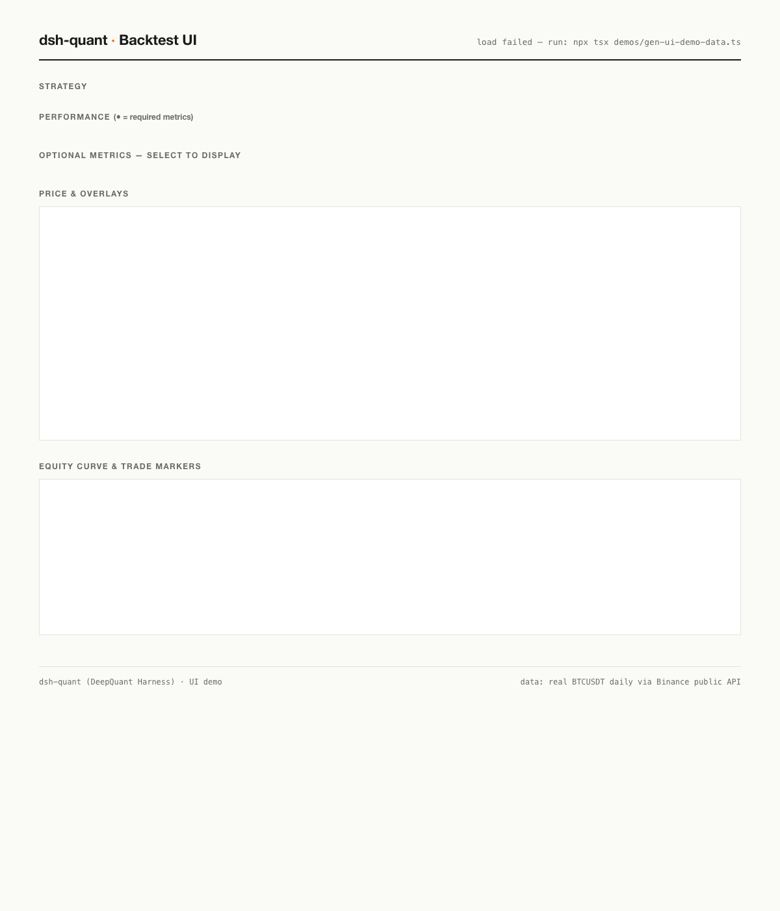

# dsh-quant（DeepQuant Harness）

🌐 **官网**：https://dsh-quant-site.pages.dev

[](https://www.npmjs.com/package/dsh-quant)
[](https://www.npmjs.com/package/dsh-quant)
[](https://github.com/pengpengyi92/dsh-quant)
[](https://dsh-quant-site.pages.dev)
[](LICENSE)
[](https://github.com/pengpengyi92/dsh-quant/actions)
[](https://github.com/topics/dsh-plugin)

给 dsh 模型的一组量化工具：行情数据获取（Binance 公共 API）+ 技术指标计算（SMA / EMA / RSI / MACD / 布林带 / ATR / KDJ / W%R / CCI / OBV / ADX / ROC）+ 三大策略回测（双均线交叉 / 布林带突破 / RSI 均值回归）+ 资金管理（止损/止盈）。

定位：**dsh 好用的 quant 研究工程（research & engineering 助手）**——R&D 是 dsh-quant 的核心：
量化场景的 agent 需要"取数据 → 算指标 → 回测"的完整链路，A 股数据走渠道导航（本插件提供
渠道知识，不提供数据 API、不为数据付费）。

**欢迎 PR，定期 merge！** 特别是数据检测与标注维度——缺值/异常/跳变/OHLCV 合法性/时间戳/冻结等常见维度已实现，欢迎贡献更多检测与标注规则（见 GitHub Issue 关于数据检测与标注的征集帖）。 只要符合 [CONTRIBUTING.md](CONTRIBUTING.md) 的契约清单即可提交；
fork/pull 下来 → `npm ci` → `npm test` 即可通过、直接使用（详见
[docs/ENVIRONMENT.md](docs/ENVIRONMENT.md)）。官方工具集（bash/fs/web/terminal/subagent…）目前没有技术指标——本插件填补这个空白。指标与回测为纯函数实现，零外部依赖，可离线验证；行情获取走免费公共 API，无需凭据。

**44 个 `quant_*` 工具 · 6 大域模块 · 167 单元测试 · 零外部依赖**。定位全景见置顶 [Issue #9](https://github.com/pengpengyi92/dsh-quant/issues/9)。

## 快速安装（dsh 用户）

```sh
npm i dsh-quant
```

在 dsh 的 cordis.yml 里加一行：

```yaml
- name: 'dsh-quant'
```

44 个工具自动注册，指标 / 回测 / 因子 / 风控 / 基金模拟 / 生态影响力开箱即用。一条 `quant_research_pipeline` 跑通 PDAT→PET 全链路。ML/DL 架构知识见 [docs/ML_GUIDE.md](docs/ML_GUIDE.md)，可执行 demo：`npx tsx demos/ml-workflow.ts`。

## 🖥️ UI 工作台（dsh-quant-ui）



[dsh-quant-ui](https://github.com/pengpengyi92/dsh-quant-ui)：K 线 + 均线叠加 + 交易标记、资金曲线、基金净值 / 管理费 / 提成卡片、指标选择器——还有一只会游泳的 Q 版鲸鱼 🐋（点标题 3 下试试）。

在线演示：https://dsh-quant-ui.pages.dev

## 工具

| 工具 | 参数 | canonical 输出 | 首个有效位置 |
|---|---|---|---|
| `quant_data_compare` | `dataType`（如 "财务"/"日线行情"）| `{ dataType, channels: [{ name, cost, covers, bestFor }] }`（覆盖者排前）| — |
| `quant_data_advice` | `dataType` + `budget`（free/low/institutional）+ `purpose`（research/backtest/official）| `{ recommendations: [{ rank, name, reason }] }`（决策树排序）| — |
| `quant_series_stats` | `values: number[]` | `{ count, mean, std, min, max, median, skew, kurtosis, autocorr1, annualizedVol, totalReturnPct }` | —（取数后第一步）|
| `quant_var_backtest` | `returns` + `varSeries` + `confidence=0.95` | `{ failures, expected, lrStat, pValue, passed, periods }`（Kupiec POF 检验）| —（VaR 模型准不准的标准答案）|
| `quant_bond` | `couponRate` + `periodsToMaturity` + `paymentsPerYear?` + 恰好一个 `ytm`/`price` | `{ price, yieldToMaturity, macaulayDuration, modifiedDuration, convexity, dv01, … }` | —（FICC 联动：定价/久期/凸性/DV01，教科书现金流折现）|
| `quant_drawdown` | `equity: number[]` | `{ underwater(对齐), maxDrawdownPct, currentDrawdownPct, periods(峰/谷/恢复/深度/时长), ongoing }` | —（回撤段分析）|
| `quant_resample` | `candles` + `period`（week=7根/month=30根）| `{ candles }`（OHLCV 周期聚合，7×24 市场）| — |
| `quant_report` | strategy/metrics/risk/factor/fund（各模块输出）| `{ report }`（Markdown 研究报告）| —（R&D 结论生成）|
| `quant_repo_stats` | `owner` + `repo` | `{ stars, forks, watchers, openIssues, openPullRequests, topics, latestRelease, … }`（GitHub 公共 API，无需凭据）| —（生态数据）|
| `quant_npm_stats` | `pkg` | `{ latest, weeklyDownloads, monthlyDownloads, description, … }`（npm registry + downloads API）| —（生态数据）|
| `quant_oss_pulse` | `stars` + `downloadsWeekly?` + `starsPrevious?` + `openIssues?` + `openPullRequests?` + `daysSinceRelease?` | `{ score(0-100), grade(A-D), components, suggestions, summary }` | —（开源影响力评分，缺省项中性 50）|
| `quant_risk` | `returns`（小数收益序列）+ `benchmarkReturns?` + `confidence=0.95` | `{ var95, cvar95, downsideDeviation, maxDrawdownPct, beta, alpha, informationRatio, trackingError, periods }` | —（风险分析核心模块）|
| `quant_fund` | `equityCurve` + `initialCapital=1e8` + `managementFeeRate=0.02` + `performanceFeeRate=0.2` | `{ initialCapital, finalNavNet, finalAum, peakNav, peakAum, gross/netReturnPct, fees, navNet }` | —（模拟量化私募：净值 1.00 起步，管理费按日，提成高水位 20%）|
| `quant_metrics` | `equityCurve` + `trades?` | `{ totalReturnPct, maxDrawdownPct, sharpe, annualizedVol, calmar, sortino, winRate, profitFactor, avgPeriodReturnPct, tradeMetrics }`（必有：收益/回撤/夏普）| —（指标目录 METRIC_CATALOG 供 UI 勾选）|
| `quant_chart` | `kind`（candles/series/annotations）+ 对应数据 | 结构化图表数据（dsh-chart 协议：K线+叠加+标记 / 多序列 / 标注可视化）| —（UI 路线数据面）|
| `quant_execute_sim` | `close` + `orders[{index, side, quantity?/valueFraction?}]` + `initialCash?` + `feeRate?` + `slippageBps?` + `latencyBars?` | `{ fills, equityCurve, finalEquity, totalReturnPct, totalFee, totalSlippageCost, tradeCount, unfilledCount, cash, position }` | —（交易执行框架，无实盘）|
| `quant_research_pipeline` | `symbol?` + `interval?` + `limit?` + `provider?` + `candles?` + 策略/基金参数 | `{ candles, quality, stats, metrics, risk, drawdown, fund, factor, report, charts }` | —（PDAT→PET 全链路一键研究）|
| `quant_factor_evaluate` | `factorValues` + `forwardReturns`（factor[i] 预测 ret[i+1]）+ `quantiles=5` + `window=20` + `decayHorizons=5` | `{ ic, rankIc, icDecay, icir, icSeries, quantileReturns, longShort, turnover, autocorr1, n }`（alphalens 指标集 + RankIC/IC衰减）| — |
| `quant_factor_neutralize` | `factorValues` + `groups?` + `styleFactors?` + `method?` | `{ values(标准化后), method, groupCount, styleCount, rSquared }` | —（分组 z-score / OLS 残差中性化）|
| `quant_walk_forward` | `returns` + `features[][]` + `trainWindow` + `testWindow` + `step?` | `{ predictions(null 对齐), oosIc, oosRankIc, oosCount, windows, trainR2Mean }` | —（滚动训练/样本外，无未来函数）|
| `quant_linear_model` | `X(样本×特征)` + `y` + `lambda?` + `predictX?` + `yTest?` | `{ intercept, weights, lambda, trainR2, n, predictions?, testR2?, testIc? }` | —（OLS/Ridge 独立拟合预测）|
| `quant_factor_combine` | `factors: number[][]`（等长）+ `weights?` | `{ signal(rank 0..1), effectiveWeights, factorCount }` | —（z-score 加权 + 截面排序）|
| `quant_series_quality` | `values: number[]`, `jumpThreshold=0.2` | `{ count, missingCount, zOutliers, jumps, longestConstantRun, healthy }` | —（序列级质量）|
| `quant_data_annotate` | `values: number[]`, `jumpThreshold=0.2` | `{ count, annotations: [{index, label, severity, detail}], summary }` | —（点级标注，致敬 Scale AI）|
| `quant_data_quality` | `candles`（quant_market_fetch 输出）| `{ count, highBelowLow, nonPositive, timeNotIncreasing, timeGaps, extremeMoves, healthy }` | —（分析前健康检查）|
| `quant_data_guide` | `query`（渠道名/数据类型，如 "tushare"/"财务"）或 `channel`（精确渠道名）| `{ query, results: [{ name, url, cost, dataTypes, setup, tutorialUrls, bestFor, … }] }` | —（内置 15 大数据渠道知识库：A股/美股/债券 + dsh 生态数据插件）|
| `quant_market_fetch` | `symbol: string`（如 BTCUSDT / sh600000 / AAPL）, `interval: 1m…1M`, `limit: 1-1000`, `provider: binance/okx/bybit/sina/tencent/yahoo` | `{ symbol, interval, provider, candles: [{openTime, open, high, low, close, volume}] }` | — |
| `quant_sma` | `values: number[]`, `window: integer` | `{ values: (number\|null)[], window }` | index `window-1` |
| `quant_ema` | `values: number[]`, `window: integer` | `{ values: (number\|null)[], window }` | index `window-1`（seed = 前 window 均值，alpha = 2/(w+1)）|
| `quant_rsi` | `values: number[]`, `window: integer = 14` | `{ values: (number\|null)[], window }` | index `window`（Wilder 平滑）|
| `quant_macd` | `values: number[]`, `fast=12`, `slow=26`, `signal=9` | `{ macd, signal, histogram }`（等长）| macd: `slow-1`；signal/histogram: `slow+signal-2` |
| `quant_bollinger` | `values: number[]`, `window=20`, `multiplier=2` | `{ upper, middle, lower, window, multiplier }` | index `window-1`（总体标准差）|
| `quant_atr` | `high/low/close: number[]`, `window=14` | `{ values: (number\|null)[], window }` | index `window`（Wilder 平滑）|
| `quant_kdj` | `high/low/close: number[]`, `window=9` | `{ k, d, j }`（等长）| index `window-1`（RSV 法，K/D 初始 50）|
| `quant_williams_r` | `high/low/close: number[]`, `window=14` | `{ values: (number\|null)[], window }` | index `window-1`（区间 -100..0）|
| `quant_cci` | `high/low/close: number[]`, `window=20` | `{ values: (number\|null)[], window }` | index `window-1`（±100 超买超卖）|
| `quant_obv` | `close/volume: number[]` | `{ values: number[] }` | 全程（首值 0，无 null）|
| `quant_adx` | `high/low/close: number[]`, `window=14` | `{ adx, plusDi, minusDi, window }` | ±DI: index `window`；ADX: index `2*window-1` |
| `quant_roc` | `values: number[]`, `window=12` | `{ values: (number\|null)[], window }` | index `window` |
| `quant_backtest` | `close: number[]`, `fast=10`, `slow=30`, `feeRate=0.001`, `stopLoss?`, `takeProfit?` | `{ totalReturnPct, maxDrawdownPct, sharpe, position, equityCurve, trades(含 exitReason) }` | 首笔交易在首次交叉确认后一根 |
| `quant_backtest_bollinger` | `close: number[]`, `window=20`, `multiplier=2`, `feeRate=0.001`, `stopLoss?`, `takeProfit?` | 同上（突破上轨买入、下穿中轨卖出）| 首次突破确认后一根 |
| `quant_backtest_rsi` | `close: number[]`, `rsiWindow=14`, `buyBelow=30`, `sellAbove=70`, `feeRate=0.001`, `stopLoss?`, `takeProfit?` | 同上（RSI 上穿 buyBelow 买入、下穿 sellAbove 卖出）| 首次信号确认后一根 |
| `quant_backtest_portfolio` | `assets: [{name, close}]`, `weights?`, `rebalanceEvery?`, `feeRate=0.001` | `{ totalReturnPct, maxDrawdownPct, sharpe, equityCurve, assetNames, finalWeights, rebalances }` | —（多资产组合）|
| `quant_backtest_grid` | `close: number[]`, `fastMin=3`, `fastMax=10`, `slowMin=10`, `slowMax=30`, `feeRate=0.001` | `{ results(按收益降序), best, fastRange, slowRange, feeRate }` | —（网格搜索，跳过 fast >= slow）|

### 典型链路（模型视角）

```
quant_market_fetch(symbol: BTCUSDT, interval: 1d, limit: 100)
  → 取 close 数组 → quant_sma / quant_ema / quant_rsi / quant_macd / … → quant_backtest
```

已实测：真实 Binance 日线 → 指标 → 回测（fast 5 / slow 20）端到端跑通。

### 回测契约

- 双均线交叉：fast SMA 上穿 slow SMA 全仓买入，下穿清仓；信号在 bar `i` 确认、`i+1` 收盘价成交（**无未来函数**）。
- 手续费按成交金额双边收取（`feeRate` 每边）。
- 尾部未平仓：最后一笔交易 `exitIndex/exitPrice/returnPct` 为 `null`。
- `position` 与 `equityCurve` 与输入等长；资金曲线归一化（初始 1）；夏普年化假设日频（√365）。

## 对齐约定

- 所有输出与输入**等长**，头部无法计算的窗口位置为 `null`——模型可以按索引直接对齐，无需自己补 padding。
- 空序列或 `window > 序列长度` 是**合法结果**（全 `null`），不是错误。
- 非有限数（NaN/Infinity）在 registry 的 lossless-JSON 参数快照层即被拒绝（模型 JSON 边界），不会到达 execute。
- 约束（window ≥ 1 整数、macd 要求 fast < slow、atr 三数组等长、multiplier > 0）在 execute 手检，抛错经 registry 转为 `isError` 结果。

## 契约（defineTool）

- 参数用统一 schema DSL，由 `defineTool` 在 execute 前校验（类型/必填/整数）。
- `execute` 只返回 canonical JSON 值；`output.render` 给模型渲染。
- 所有工具 `isConcurrencySafe: true`——纯函数、无共享状态、无副作用，可并行调度。
- 注册是可逆 effect：`ctx.tools.register` 返回 disposer，fiber 释放即注销。

## Model Experience

### 模型看到什么

每个工具的 name/description/JSON schema 自动进入系统提示词装配（`ctx.systemPrompt.tools()`）。description 说明了对齐约定（哪些头部位置是 null），模型无需猜测。

### Token 影响

每个工具固定一份 schema 成本；调用结果按渲染内容计。`null` 对齐设计避免了模型为了对齐而重复请求 padding 计算。

### KV Cache 影响

schema 前缀稳定（工具集与顺序不变则复用）；结果追加在可复用前缀之后。

## 迭代记录（NEWS）

| 版本 | 日期 | 更新 |
|---|---|---|
| 0.20.0 | 2026-08-16 | 数据整合：yahoo 美股/全球行情 + 渠道库扩到 13（含 dsh 生态数据插件）+ researchMultiAsset 多标的并行研究 |
| 0.19.0 | 2026-08-16 | PCPT 补完：quant_linear_model（OLS/Ridge）+ docs/ML_GUIDE.md（ML/DL 架构知识地图）+ demos/ml-workflow.ts（42→43 工具）|
| 0.18.0 | 2026-08-16 | 链路补全：A股免费行情（新浪/腾讯前复权）+ RankIC/IC衰减 + 因子中性化 + Walk-forward + 回撤分析 + 执行模拟 + 端到端管线（37→42 工具）|
| 0.17.0 | 2026-08-16 | 开源生态域 dsh-community：quant_repo_stats / quant_npm_stats / quant_oss_pulse（0-100 影响力评分）|
| 0.16.0 | 2026-08-16 | 域驱动重构：dsh-data/alpha/ml/risk/execution ↔ PDAT/PAAT/PCPT/PRT/PET + 交易所容错链（Binance→OKX→Bybit）|
| 0.15.0 | 2026-08-16 | Kupiec VaR 回测 + 周期聚合 + 研究报告生成；100 单元测试里程碑 |
| 0.14.0 | 2026-08-16 | 风控模块 quant_risk（VaR/CVaR/Beta/Alpha/IR/TE）|
| 0.13.0 | 2026-08-16 | 基金模拟 quant_fund（1 亿起、净值 1.00、高水位 20% 提成）+ UI Fund 卡片 |
| 0.12.0 | 2026-08-16 | 指标目录 quant_metrics（9+ 指标）+ Jane Street 风格 UI demo |
| 0.11.0 | 2026-08-16 | 图表协议 quant_chart（dsh-chart 数据面）|
| 0.10.0 | 2026-08-16 | 因子评估 quant_factor_evaluate / combine（alphalens 方法论）|
| 0.9.0 | 2026-08-16 | 统计 quant_series_stats + 数据质量 quant_data_quality + 标注（致敬 Scale AI）|
| 0.8.0 | 2026-08-16 | 渠道对比 quant_data_compare + 决策树建议 quant_data_advice |
| 0.7.0 | 2026-08-16 | mcp/tools.json + 纯函数 re-export + 文档体系 |
| 0.6.0 | 2026-08-16 | 数据渠道指南 quant_data_guide（A 股 8 大渠道）+ 更名 dsh-quant |
| 0.5.0 | 2026-08-16 | 多交易所数据源（OKX / Bybit）|
| 0.4.0 | 2026-08-16 | 多资产组合回测（定期再平衡）|
| 0.3.0 | 2026-08-16 | 策略族（布林带突破 / RSI 反转）+ 止损止盈 + exitReason |
| 0.2.0 | 2026-08-16 | +6 指标（KDJ / W%R / CCI / OBV / ADX / ROC）|
| 0.1.0 | 2026-08-16 | 首发：行情 + 6 指标 + 双均线回测/网格 + CI/自动发布 |

完整更新记录见 [NEWS.md](NEWS.md) 与 [CHANGELOG.md](CHANGELOG.md)。

## 已知限制与后续路线

- **行情覆盖加密市场**：Binance / OKX / Bybit 三所公共 API（自动容错切换），无需凭据；A 股走渠道知识库导航（akshare 等作为后续 provider）。
- **回测为内置策略族**：双均线 / 布林带突破 / RSI 反转 / 组合再平衡 / 网格搜索；自定义策略回调是后续路线。
- **presentCall/presentResult 未定制**：指标结果无文件/终端/diff 语义，UI 走 generic 卡片兜底。
- **行情工具依赖网络**：在线用例在 verify.ts 中，网络不可达时该用例失败（离线指标/回测用例不受影响）。

## 域结构（PDAT→PET pipeline 映射）

```
src/dsh-data/      数据域（PDAT）：行情 3 所、A 股 8 渠道、质量/标注、周期聚合
src/dsh-alpha/     因子域（PAAT）：12 指标 + 因子评估/合成（alphalens 方法论）
src/dsh-ml/        组合域（PCPT）：策略回测 + 组合 + 指标库
src/dsh-risk/      风控域（PRT）：VaR/CVaR/Beta/Alpha/IR + Kupiec 检验
src/dsh-execution/ 交付域（PET）：chart 数据面、基金模拟、研究报告（不接实盘）
src/dsh-community/ 开源生态域（dsh-quant 独有）：GitHub/npm 生态数据 + 影响力评分 pulse
```

**内外边界**：数据与结论留在内部，工具与方法进入 dsh-quant——外部不提供 alpha / 生产策略 / 实盘工程，但提供框架、指标、因子评价、UI 与 demo。详见置顶 [Issue #9](https://github.com/pengpengyi92/dsh-quant/issues/9)。

## 快速开始（fork/pull 后）

```sh
npm ci && npm run build && npm test    # 离线全测试（100 单元 + 4 Loader）
npm run test:verify                    # 真实行情集成（需网络）
npm run gen:tools                      # 重新生成 mcp/tools.json
```

## 构建与使用

```sh
# 构建 lib/（tsc, NodeNext ESM；产物含 .js + .d.ts）
cd quant-indicators && tsc -p tsconfig.json

# 在 dsh 中使用：cordis.yml 里加一行
# - name: 'dsh-quant'
# （Loader 从 node_modules 解析包的 exports → lib/index.js）
```

## 验证

```sh
# 纯函数数值正确性 + 行情解析 + 回测（100 用例，node:test，零依赖）
cd deepseek-harness && pnpm exec tsx --test ../quant-indicators/tests/indicators.spec.ts ../quant-indicators/tests/market.spec.ts ../quant-indicators/tests/backtest.spec.ts

# REAL-composition：cordis.yml 经真实 Loader boot（4 用例：注册可见/管线/isError/HMR-safety）
cd deepseek-harness && pnpm exec tsx --test ../quant-indicators/tests/loader-composition.spec.ts

# harness 集成（schemas → 执行管线 → isError → 真实行情 fetch→指标→回测 端到端）
cd deepseek-harness && pnpm exec tsx ../quant-indicators/verify.ts

# 消费者模拟：真实 node_modules 解析加载构建产物 lib（模拟 npm 安装后）
cd deepseek-harness && pnpm exec tsx ../quant-indicators/consumer-test/boot.ts
```

## ⭐ 支持

如果 dsh-quant 帮到了你的研究，欢迎点个 ⭐——每一颗星都会让更多 dsh 用户看到这个项目。

欢迎 issue / PR / discussion，也欢迎把你的域视角发到 [Discussion #10](https://github.com/pengpengyi92/dsh-quant/discussions/10) 一起交流。🐋
