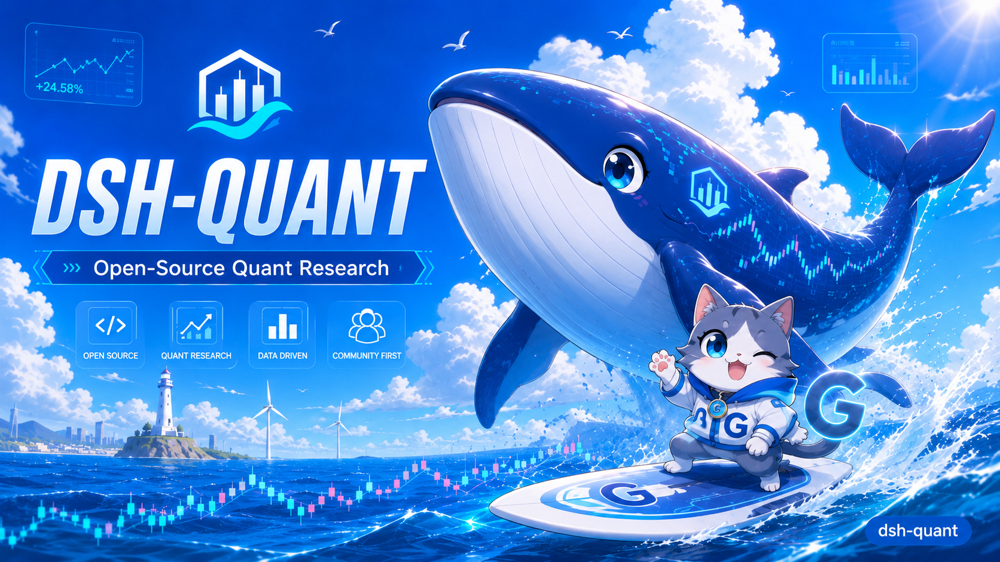

# X Promotion Snapshot — Open-Source Edition

- Captured at: 2026-09-01T13:46:58+08:00
- Channel: X
- Campaign: dsh-quant open-source introduction
- Publication status: copy archived; external post receipt not recorded
- GitHub: https://github.com/pengpengyi92/dsh-quant
- npm: https://www.npmjs.com/package/dsh-quant
- Install command: npm i dsh-quant
- Visual asset: [assets/dsh-quant-open-source-hero.png](../assets/dsh-quant-open-source-hero.png)
- Asset dimensions: 1672 x 941
- Asset SHA-256: F094E7AA93A13DF5D2676BEA963E07200CFCCBA2D38247F1AA5A5BDB761F63A0

## Long Version

🚀 开源一个 AI-native Quant 工具箱：dsh-quant

量化最痛的事之一：数据、因子、回测、风控、执行散落在不同框架里，
AI Agent 也很难直接调用。

dsh-quant 的答案是：

> Everything is a Plugin.

data → alpha → ml → risk → exec

一条完整量化研究链路，全部模块化、Agent-ready。

目前：

- ⚡ 59 个 quant_* 工具
- 🧪 215 个单元测试
- 📚 162 篇 quant-history 知识库
- 📦 0 runtime dependencies
- 🤖 LLM 可直接调用的结构化 schema
- 📈 npm 月下载 18,855（2026-08）

方法公开，Alpha 私有。

GitHub: https://github.com/pengpengyi92/dsh-quant

npm:

    npm i dsh-quant

#quant #opensource #AI #DeepSeek #TypeScript #量化

## Ultra-Short Version

🐳 dsh-quant：把 Quant Research 变成 AI Agent 可以直接调用的工具箱。

data → alpha → ml → risk → exec

- ⚡ 59 个 quant tools
- 🧪 215 tests
- 📚 162 篇量化知识库
- 📦 0 runtime deps
- 🤖 AI-native / Plugin-first

Everything is a Plugin.

Methods are open. Alpha stays private.

https://github.com/pengpengyi92/dsh-quant

#quant #opensource #AI #量化

## Reuse Boundary

This file preserves the supplied 2026-09-01 campaign copy. Its numerical claims
are a time-stamped promotion snapshot, not automatically updated repository
facts. Revalidate every metric before reposting; preserve this original record
for campaign history.
